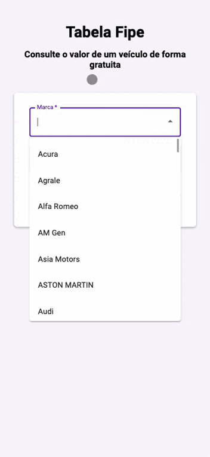
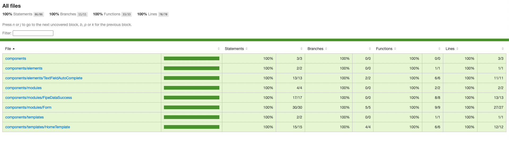

<h3 align="center">
    
    <br><br>
    <b>Fipe Consultation</b>
    <br>
</h3>

# Index

- [Objetivo da aplicação](#purpose)
- [Exercícios](#exercises)
- [Tecnologias utilizadas](#technologies-used)
- [Resultados](#results)
- [Como utilizar](#how-to-use)
- [Como contribuir](#how-to-contribute)

<a id="purpose"></a>

## :bookmark: Objetivo da aplicação

O projeto é dividido em duas seções, onde o diretório `exercises` concentra quatro arquivos de exercícios que serão detalhados mais para frente e o outro diretório `fipe-project` é onde terá o projeto de consulta de valores de automóveis na tabela fipe.

<a id="exercises"></a>

## :book: Exercícios

O projeto possui quatro exercícios, sendo eles:

1. Maskify:
```sh
  Função que tem o objetivo de mascarar dados parcialmente, mantendo visível apenas os últimos 4 caracteres.
  A função recebe o texto por parâmetro e retorna o texto mascarado.
```
2. Update Data:
```sh
  Função que tem o objetivo atualizar um objeto com base nos dados de um segundo objeto.
  A função recece os dois objetos por parâmetro, verifica se no segundo objeto tem chave que o primeiro objeto tem,
  e caso tenha, atualiza o dado, e retorna o objeto atualizado.
```
3. Get Rick and Morty characters data:
```sh
  Função que tem o objetivo buscar os dados dos personagens da série "Rick and Morty" e
  retornar os dados dos personagens principais com a estrutura de dados alterada.
```
4. Check if the first letter is uppercase:
```sh
  O nome dessa função já é bem sugestivo, ela recebe uma string via parâmetro e
  retorna um booleano indicando se a string possui a primeira letra maiúscula.
```

Se deseja testar as funções e se divertir com elas, a pasta de exercícios possui um arquivo `examples.js` que já possui alguns exemplos, fique a vontade para criar outros.

<a id="technologies-used"></a>

## :rocket: Tecnologias utilizadas

Esse projeto foi desenvolvido utilizando as seguintes tecnologias:
- [TypeScript](https://www.typescriptlang.org/)
- [React](https://reactjs.org/)
- [Next](https://nextjs.org/)
- [Styled Components](https://styled-components.com/)
- [Material UI](https://mui.com/)
- [Jest](https://jestjs.io/pt-BR/)
- [React Testing Library](https://testing-library.com/docs/react-testing-library/intro/)
- [ESLint](https://eslint.org/)
- [Prettier](https://prettier.io/)


<a id="results"></a>

## :heavy_check_mark: :computer: Resultado Web

<h1 align="center">
    
</h1>

## :heavy_check_mark: :computer: Resultado Mobile

<h1 align="center">
    
</h1>

## :heavy_check_mark: :computer: Cobertura de testes unitários

<h1 align="center">
    
</h1>

<a id="how-to-use"></a>

## :fire: Como utilizar

- ### **Pré-requisitos**

  - É **necessário** possuir o **[Node.js](https://nodejs.org/en/)** instalado na sua máquina
  - Também, é **preciso** ter um gerenciador de pacotes, seja o **[NPM](https://www.npmjs.com/)** ou **[Yarn](https://yarnpkg.com/)**.

1. Faça um clone:

```sh
  $ git clone git@github.com:lucasfelixc/fipe-consultation.git
```

2. Executando a aplicação:

```sh
  # Instale as dependências
  $ cd fipe-project && npm install or yarn install

  # Inicie a aplicação web
  $ cd fipe-project && npm run dev or yarn dev
```

3. Testando a aplicação:

```sh
  # Para executar os testes e gerar o coverage
  $ cd fipe-project && npm run coverage or yarn coverage
```

<a id="how-to-contribute"></a>

## :recycle: Como contribuir

- Faça um Fork desse repositório,
- Crie uma branch com a sua feature: `git checkout -b my-feature`
- Commit suas mudanças: `git commit -m 'feat: My new feature'`
- Push a sua branch: `git push origin my-feature`

---

<h4 align="center">
    Feito com 🧡 by <a href="https://www.linkedin.com/in/lucasfelixdev/" target="_blank">Lucas Felix</a>
</h4>
